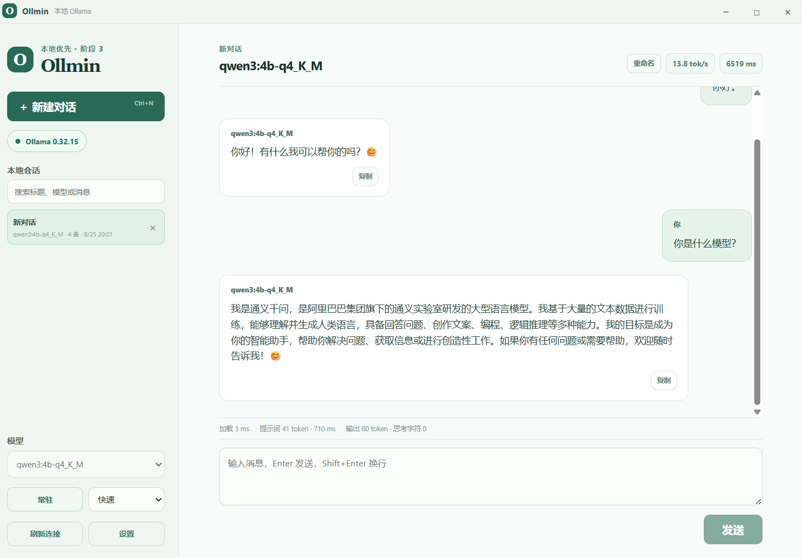

<p align="right">
  <a href="README.md">English</a> | <a href="README.zh-CN.md">简体中文</a>
</p>

<div align="center">
  <h1>Ollmin</h1>
  
</div>

<p align="center">
  <em>面向低性能设备和本地小模型的轻量 Ollama 桌面客户端。</em>
</p>

<p align="center">
  
  
  
  
  
  
  
  
</p>

Ollmin 的目标不是把聊天客户端做得更复杂，而是让本地 Ollama 的一次对话尽量接近 `ollama run` 的体验：少发不必要的上下文，默认避免无关思考和后台请求，保持单请求生成，并把等待原因和真实性能指标展示出来。

## Ollmin 是什么？

Ollmin 是一个 Windows 本地优先桌面客户端，直接连接本机 `127.0.0.1:11434` 上运行的 Ollama。它适合在 CPU、核显、低显存或内存有限的设备上运行 Qwen3-4B 等小模型。

应用不会上传提示词、响应、会话或硬件数据，也不提供账号、云端 API、联网搜索、MCP、Shell、文件执行或模型工具调用。

## 当前功能

- 本机 Ollama 连接检测、模型列表和模型常驻/预热；
- 原生 `/api/chat` NDJSON 流式聊天；
- 快速、平衡、推理三种性能模式；
- 快速模式关闭思考、使用 4K 上下文、`num_predict=2048`，并按完整对话轮次裁剪历史；
- 思考内容与正文分离，支持停止生成、复制和输出中自动滚动；
- 标题、粗体、斜体、删除线、列表、引用、分隔线等基础 Markdown 渲染；
- SQLite 本地会话：搜索、重命名、恢复、删除和 Markdown/JSON 导出；
- 设置新会话默认模型和模型别名；
- 加载、提示词预填充、输出 token、tok/s、思考字符和终止原因等指标；
- 流式事件批处理、前端更新合并、Debug 诊断和自定义无边框标题栏。

## 界面预览

<p align="center">
  
</p>

## 运行前准备

需要：

- Windows 10/11；
- Node.js（用于前端开发和构建）；
- Rust 工具链和 Tauri 2 开发环境；
- 已安装并运行 Ollama；
- 至少一个本地模型。

例如：

```powershell
ollama serve
ollama pull qwen3:4b
```

如果 Ollama 使用其他模型名称，直接在客户端模型列表中选择即可。

## 快速开始

```powershell
git clone https://github.com/lincux0/ollmin.git
cd ollmin
npm install
npm run tauri -- dev
```

开发窗口启动后，在左侧选择模型，选择性能模式，输入消息并发送。设置中的默认模型用于新会话；模型别名保存后会立即应用到当前界面和后续显示。

仅运行 `npm run dev` 或 `npm run preview` 可以查看前端样式，但浏览器没有 Tauri `invoke` 运行时，不能代替桌面客户端连接 Ollama。

## 三种性能模式

| 模式 | 默认策略 | 适合场景 |
| --- | --- | --- |
| 快速 | `think=false`、4K 上下文、2048 输出上限、严格裁剪历史 | 短问答、翻译、改写、低配设备 |
| 平衡 | `think=true`、4K 上下文、768 输出上限 | 日常多轮讨论 |
| 推理 | `think=true`、8K 上下文、2048 输出上限 | 复杂分析和代码排错 |

这些是实际发送给 Ollama 的请求配置，不是对模型原始推理速度的保证。模型量化、处理器、内存带宽、是否已加载和上下文长度都会影响最终 tok/s。

## 工作方式

```text
React UI
  │ Tauri invoke / events
  ▼
Rust 后端
  ├─ 连接本机 Ollama
  ├─ 解析 NDJSON、分离思考/正文
  ├─ 单请求调度、取消和性能诊断
  └─ 读写本地 SQLite
       │                         │
       ▼                         ▼
127.0.0.1:11434              %APPDATA%\com.ollmin.desktop\ollmin.sqlite3
Ollama /api/*                本地会话、设置和导出数据
```

## 构建和测试

```powershell
# 前端
npm run test
npm run build

# Rust
cargo fmt --manifest-path src-tauri/Cargo.toml -- --check
cargo test --manifest-path src-tauri/Cargo.toml

# 桌面程序
npm run tauri -- build --debug
npm run tauri -- build
```

构建产物：

- Debug：`src-tauri/target/debug/ollmin.exe`（保留控制台，便于调试）；
- Release：`src-tauri/target/release/ollmin.exe`（隐藏 Windows 控制台）。

当前 `tauri.conf.json` 未启用 installer bundle，因此仓库现阶段主要产出可执行文件，而不是 MSI/NSIS 安装包。

## 发布方式

每次发布前先确认 `package.json`、`src-tauri/Cargo.toml` 和 `src-tauri/tauri.conf.json` 的版本一致，然后执行测试、前端构建和 Rust 检查。通过 GitHub Actions 的 `main` 分支检查后，维护者可以创建版本标签（例如 `v1.0.0`），并在 GitHub Release 中附上对应的 Release notes 和 Windows Release 可执行文件或安装包。

当前 installer bundle 保持关闭，生成 MSI/NSIS 安装包属于单独的发行步骤，不会随普通 Debug/Release 验证自动产生；需要安装包时再显式启用并验证对应的 Tauri bundle 配置。

## 本地数据与隐私

- SQLite 文件：`%APPDATA%\com.ollmin.desktop\ollmin.sqlite3`；
- 会话、消息和设置默认只保存在本机；
- 思考内容默认不保存，只有在设置中开启后才写入新消息；
- 导出必须由用户显式触发；
- 不包含遥测、账号体系、云端同步和后台模型请求；
- 模型输出不会被当作 HTML、命令、脚本或工具调用执行。

## 常见问题

### 客户端显示 Ollama 未连接

确认 Ollama 已启动，并检查本机接口：

```powershell
Invoke-RestMethod http://127.0.0.1:11434/api/version
```

客户端只连接 `127.0.0.1:11434`，不会自动切换到远程地址。

### 为什么 Debug 版本会打开终端？

这是 Debug 构建为了保留 Rust 日志而使用的控制台窗口；Release 构建会隐藏 Windows 控制台。它不是客户端额外启动的终端工具。

### 为什么平衡/推理模式比快速模式慢？

平衡和推理模式允许思考，推理模式还使用更大的上下文和输出预算。请结合界面中的加载、提示词和生成指标判断瓶颈，不要只用一次回答的总耗时下结论。

## 贡献与安全

- [贡献指南](CONTRIBUTING.zh-CN.md)
- [安全政策](SECURITY.zh-CN.md)
- [行为准则](CODE_OF_CONDUCT.zh-CN.md)
- [更新日志](CHANGELOG.zh-CN.md)

## 当前状态与边界

Ollmin 当前版本为 `1.0.0`，已完成可用聊天闭环、本地会话、性能档位、前端链路优化和 Debug/Release 构建验证。完整的桌面 Playwright E2E、安装包签名、自动更新和跨设备能力尚未纳入当前版本。

欢迎围绕本机 Ollama、低配设备性能、流式体验和本地隐私边界提交问题或改进建议。新增功能应先评估 token、内存、权限和请求次数成本。

## 许可证

本项目采用 MIT License，详见 [LICENSE](LICENSE)。
